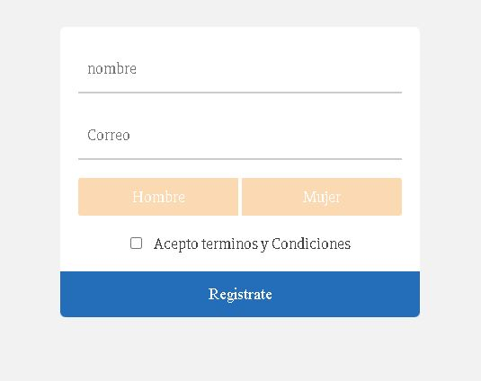

# Formulario de Registro.
## Descripción.
Este formulario de registro de manera sencilla nos muestra como un usuario antes de poder enviar un formulario debe sellecionar y rellenar ciertos inputs, de manera contraria en formulario no se podra enviar.
## Tecnologias utiilizadas para desarrollar este proyecto.

Las tecnologias usadas son las siguiente:

* HTML5
* CSS3
* JS

